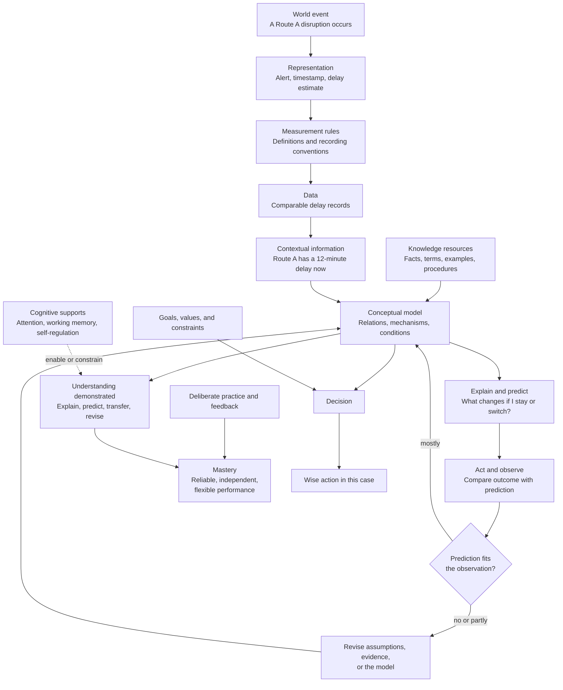

> **Chinese version:** [/zh-hant/knowledge/knowledge-full-map/](/zh-hant/knowledge/knowledge-full-map/)

> **Status:** Working map for learning and diagnosis, created on 2026-09-18. It combines this workspace's practical definition of knowledge with the useful distinctions—and corrections—drawn from the KL02 subtitle. It is not a final philosophical theory, and it is not evidence that the learner can yet use every distinction independently.

## The core idea

For this workspace, **knowledge** is relatively dependable, appropriately supported content or competence that a person can retain, retrieve, and use to guide more accurate reasoning or action in a specified context.

This definition deliberately has limits:

- **Relatively dependable**, not certain: empirical claims can require revision.
- **Appropriately supported**, not merely heard or confidently believed.
- **Specified context**, not “always” or “for every case.”
- **Content or competence**: knowing a claim and knowing how to do something are both relevant, but they are not identical.
- **Usable**: unavailable or inert material cannot guide the person when it matters.

The KL02 video adds a helpful question: *What reusable relation or structure lies behind individual pieces of information?* Its mistake is to call only that reusable structure “knowledge.” Facts, terms, examples, procedures, and records are also knowledge resources; a conceptual model connects them so they can be used.

## One running example: choosing a commute

A commuter normally takes Route A to work. One morning, the official transit app reports a twelve-minute service delay.

| Concept | What it is | Commute example | What it is **not** |
|---|---|---|---|
| **World event** | Something occurring in reality. | A service disruption occurs on Route A. | The app message or a number on a screen. |
| **Representation** | A selected symbol, description, or measurement of an event. | “12-minute delay,” a timestamp, and a route alert. | The whole disruption, including every cause and effect. |
| **Measurement rule** | A convention that makes records comparable. | The app defines what counts as a delay and timestamps its estimate. | A universal law about all rail journeys. |
| **Data** | Recorded values or observations under stated conventions. | Delay times for comparable weekday journeys. | An explanation of why the delays occur. |
| **Information** | A meaningful, contextual statement interpreted from data or reports. | “Route A has a twelve-minute delay this morning.” | A guarantee about every future morning. |
| **Knowledge resources** | Supported facts, terms, examples, rules, and procedures. | Knowing the alternative routes, typical journey times, and how to read the alert. | One single theory that answers everything. |
| **Conceptual model** | An organised relation that explains or predicts under conditions. | “When Route A has a substantial disruption at this time, its normal predictability falls; compare alternatives before leaving.” | A memorised slogan such as “Route A is always best.” |
| **Understanding** | Usable grasp shown through reasoning with the model. | Predicts late arrival if staying on Route A; explains why; changes route when the conditions fit. | Repeating the model without using it. |
| **Mastery** | Reliable, independent, appropriately flexible performance in a defined task class. | Repeatedly checks relevant evidence, chooses well, and corrects errors across varied disruptions. | One lucky correct route choice. |
| **Wise decision** | A choice that uses knowledge while balancing goals, values, uncertainty, and constraints. | Choose the route that best fits the need to arrive on time, cost, safety, and current information. | A rule that is automatically best for every goal. |

## The whole map

The diagram is a **feedback system**, not a compulsory ladder. Existing models affect what is measured; observations can expose a failed prediction; revision changes the next action. A learner can enter at more than one point. For example, a teacher can first provide a model, then ask the learner to test it against cases.

## Four distinctions that prevent common confusion

### 1. Event is not representation

“Route A is delayed by twelve minutes” may be useful and accurate, but it leaves out the physical causes, future changes, passenger crowding, and uncertainty in the estimate. Good reasoning asks what the representation captures and what it omits.

This is the strongest contribution of the video's event → representation → rule → data distinction.

### 2. Data and information are not explanation

A spreadsheet can show that Route A was delayed on several mornings. “Route A was delayed three times this week” is information. Neither statement alone establishes why it happened or whether the same pattern will recur.

A model must name a relation, mechanism, or conditional regularity. For example: “During a signal failure, Route A's usual timetable is no longer a good predictor; current service status should outweigh the usual route preference.” The claim can still be wrong, but it is now clear enough to test.

### 3. Knowledge is broader than a general law

The video is right that reusable relations are particularly valuable. They support transfer. But a relation cannot be built or checked without other resources:

- a **fact**: Route B exists;
- a **term**: what “service disruption” means;
- an **example**: a previous signal failure;
- a **procedure**: how to compare route alerts;
- a **relation**: a large current delay weakens the value of Route A's usual reliability.

Do not choose between “information bricks” and “knowledge structure.” Build a tested structure *from* appropriately supported materials.

### 4. Understanding, mastery, and wisdom answer different questions

| Question | Concept | Evidence in the commute example |
|---|---|---|
| What reliable material or competence is available? | **Knowledge** | The commuter knows routes, alert terms, and a conditional relation. |
| Can the person reason with it in a changed case? | **Understanding** | They explain why the normal route rule no longer applies and predict the consequence. |
| Can the person do it accurately and independently over time? | **Mastery** | They repeatedly make sound route choices without prompts and correct errors. |
| What should be done, given competing aims? | **Wisdom / decision** | They balance punctuality, cost, safety, energy, and uncertainty. |

A recipe, algorithm, or equation does not automatically count as wisdom. It becomes part of wise action only after goals and trade-offs are made explicit.

## Understanding must be demonstrated

A fluent explanation can be memorised. A correct prediction can be guessed. Therefore no single answer proves robust understanding. Seek progressively stronger evidence:

1. **Recognition** — identify the relevant term, rule, or example.
2. **Explanation** — state the relation and relevant conditions.
3. **Guided application** — use the relation with a prompt or worked example.
4. **Independent proficiency** — perform typical tasks accurately without prompts.
5. **Transfer** — adapt the relation to a changed or unfamiliar case.
6. **Diagnosis and teaching** — locate an error, improve an approach, compare alternatives, or explain it to another person.

These are practical evidence levels, not a claim that every topic follows one rigid staircase. The key question is always: **what performance would distinguish recall from model-based use in this task?**

## Cognitive supports are not proof of understanding

Attention, working memory, and self-regulation help a person hold conditions in mind, monitor a plan, and persist through difficulty. They can enable or constrain the use of knowledge.

However:

- strong concentration plus verbatim recall does **not** demonstrate understanding;
- a person may understand a relation but fail to show it under overload, fatigue, distraction, or time pressure;
- a short task cannot rank a person's overall cognitive ability.

When performance fails, diagnose at least three possibilities: missing knowledge/model, overloaded cognitive support, or insufficient practice/mastery. The right next drill depends on which is earliest failure.

## A practical method for learning any topic

Use the model as a sequence of questions rather than as material to memorise.

1. **Name the target event or task.** What are you trying to explain, predict, do, or decide?
2. **Separate record from reality.** Which numbers, labels, examples, or descriptions are representations? What do they omit?
3. **Check data quality and conditions.** How were observations measured? What rule, sample, or context limits them?
4. **State the information claim.** What does this report say about this case?
5. **Build or retrieve a model.** Which facts, mechanisms, procedures, and relations matter? Write the conditions.
6. **Make a changed-case prediction.** What would happen if one relevant variable changed, and why?
7. **Compare with evidence.** Did the result fit? If not, find the earliest unsupported assumption.
8. **Practise for the required performance level.** Do not confuse one explanation with independent proficiency or transfer.
9. **Decide explicitly.** State the goal, constraint, uncertainty, and trade-off behind the chosen action.

## Boundaries of this map

This is a learning and diagnosis tool, not a universal ontology. It does not settle philosophical debates about the final definition of knowledge. It also does not say that every fact must be independently rediscovered from raw data, or that all learning must begin with real-world experience. Testimony, instruction, books, models, and worked examples can be good sources when their support and limits are understood.

Its standard is practical: can the learner use appropriately supported material to reason and act more accurately under stated conditions, notice failure, and improve?

## Related notes

- [Knowledge: a working map](/knowledge/knowledge-as-a-working-model/)
- [Knowledge, Information, and Understanding: KL02 Analysis](/knowledge/knowledge-information-understanding-analysis/)
- [Understanding as a working model](/knowledge/understanding-as-a-working-model/)
- [Cognitive supports versus understanding ability](/knowledge/cognitive-supports-versus-understanding/)
- [Understanding and mastery](/knowledge/understanding-and-mastery/)
- [Learning concept map: from cognitive supports to mastery](/knowledge/learning-concept-map/)