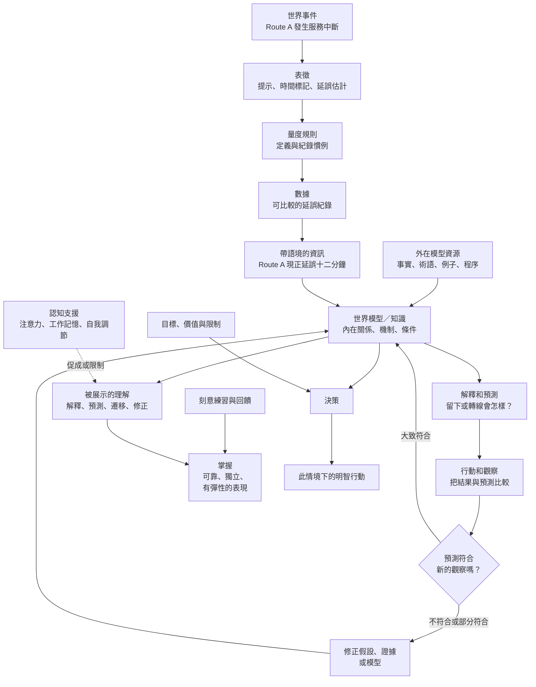

<!-- 此中文譯本對應英文權威 post：[/knowledge/knowledge-full-map/](/knowledge/knowledge-full-map/)。如有差異，以英文版為準。 -->

> **英文版本：** [/knowledge/knowledge-full-map/](/knowledge/knowledge-full-map/)

> **狀態：** 2026-09-18 建立、並於 2026-09-20 重新定位的學習與診斷工作圖。它結合從 KL02 字幕提取的有用區分與修正，以及 workspace 現時的核心前提：知識是學習者所構建、可修訂的世界模型。它不是最終的哲學理論，也不是學習者已能獨立運用每一項區分的證據。

## 核心概念

在本 workspace 中，**知識**是學習者可修訂的世界模型中、相對可靠、得到適當支持而可被使用的部分：對物件、關係、條件、程序和可能後果所作的、內在而有組織的表徵。

這個定義刻意包含限制：

- **相對可靠**，不是確定無疑：實證主張可以需要修正。
- **有適當支持**，不是只聽過或自信地相信。
- **指定情境**，不是「永遠」或「每一個個案」都成立。
- **內在模型，不是外部儲存**：筆記、書籍、影片或 LLM 回應可以更新模型，卻不會自動成為學習者的知識。
- **事實、程序和能力有別**：事實和程序可成為模型組成；技能和能力是使用模型時的表現。
- **可用**：若模型組成在需要時不能取用或沒有作用，它就不能引導人。

KL02 影片補上一條有用問題：*單一資訊背後有甚麼可重用的關係或結構？* 它的錯誤是把外部記錄的材料視為會自動變成知識的階層。事實、術語、例子、程序和紀錄是模型資源。當學習者把它們建構成可檢驗、可修訂的內在關係時，才構成知識。

## 一個貫穿例子：選擇上班路線

一名通勤者平日乘 Route A 上班。某天早上，官方交通 app 顯示服務延誤十二分鐘。

| 概念 | 它是甚麼 | 通勤例子 | 它**不是**甚麼 |
|---|---|---|---|
| **世界事件** | 現實中正在發生的事。 | Route A 發生服務中斷。 | app 訊息或螢幕上的數字。 |
| **表徵** | 對事件作選擇性的符號、描述或量度。 | 「延誤 12 分鐘」、時間標記和路線提示。 | 包括全部成因與後果的完整中斷本身。 |
| **量度規則** | 令紀錄可比較的慣例。 | app 定義何謂延誤，並為估計加上時間標記。 | 關於所有鐵路旅程的普遍定律。 |
| **數據** | 在已說明慣例下記錄的數值或觀察。 | 可比較的平日延誤時間紀錄。 | 延誤為何發生的解釋。 |
| **資訊** | 由數據或報告解讀出的、有意義而帶語境陳述。 | 「今天早上 Route A 現正延誤十二分鐘。」 | 對每一個未來早晨的保證。 |
| **模型資源** | 可更新學習者模型的外在事實、術語、例子、規則和程序。 | 提示、路線圖、一般行程時間，以及核對替代路線的指示。 | 只因材料可取得，便已是知識。 |
| **世界模型／知識** | 在條件下用於解釋或預測的、有組織內在關係。 | 「在這個時段 Route A 有明顯中斷時，它平日的可預測性會下降；出門前應比較替代路線。」 | 一句死背口號或彼此不連結的外部筆記。 |
| **理解** | 對模型作出已展示的推理和修訂。 | 預測繼續乘 Route A 會遲到；解釋原因；條件符合時改走其他路線。 | 不使用而只是重複模型。 |
| **掌握** | 在界定的一類任務中可靠、獨立而有適當彈性的表現。 | 在不同中斷情況中反覆查看相關證據、選得恰當並修正錯誤。 | 一次幸運地選對路線。 |
| **明智決策** | 使用知識，同時權衡目標、價值、不確定性與限制的選擇。 | 選擇最符合準時、成本、安全與當前資訊需要的路線。 | 對每個目標都自動最佳的規則。 |

## 全貌圖

這張圖是一個**回饋系統**，不是必須逐級向上的樓梯。已有模型影響量度甚麼；觀察可暴露失敗的預測；修正會改變下一步行動。學習者可由多於一個入口進入。例如，教師可先提供模型，再要求學習者用個案檢驗它。

## 四項可防止常見混淆的區分

### 1. 事件不是表徵

「Route A 延誤十二分鐘」可能有用而準確，但它漏掉實際成因、後續變化、乘客擠塞，以及估計的不確定性。好的推理會問：表徵捕捉了甚麼，又忽略了甚麼？

這是影片由事件到表徵、規則與數據的區分中，最強的一項貢獻。

### 2. 數據和資訊不是解釋

試算表可顯示 Route A 在幾個早晨延誤。「Route A 本週延誤了三次」是資訊。兩者本身都不能確立為甚麼發生，或相同 pattern 是否會再次出現。

模型必須指出一個關係、機制或帶條件的規律。例如：「發生訊號故障時，Route A 平日的時刻表不再是良好預測；當前服務狀態應比平日的路線偏好更重要。」這主張仍可錯，但現在已清楚到可被檢驗。

### 3. 知識是內在模型，不是一般定律或外在集合

影片正確地說可重用關係特別有價值，因為它們支援遷移。但一條一般定律或一堆外在資源，仍未是學習者的知識。學習者需要從下列資源建構關係，並用它們作檢驗：

- 一個**事實**：Route B 存在；
- 一個**術語**：甚麼是「服務中斷」；
- 一個**例子**：之前一次訊號故障；
- 一項**程序**：怎樣比較不同路線提示；
- 一個**關係**：當前明顯延誤會削弱 Route A 平日可靠性的價值。

不要在「資訊磚塊」與「知識結構」之間二選一。要由有適當支持的材料，建立並檢驗一個可修訂的內在結構。

### 4. 理解、掌握和智慧回答不同問題

| 問題 | 概念 | 通勤例子中的證據 |
|---|---|---|
| 此人已在世界模型中建構甚麼相關關係？ | **知識** | 通勤者有一條把中斷、路線可靠性與比較替代路線連結起來的內在關係。 |
| 此人能否用它推理並修訂一個改變的個案？ | **理解** | 他解釋為何平日路線規則不再適用、預測後果，並在證據衝突時更新關係。 |
| 此人能否長期準確、獨立地做到？ | **掌握** | 他反覆作出合理路線選擇，不靠提示並能修正錯誤。 |
| 在互相競爭的目標下應怎樣做？ | **智慧／決策** | 他權衡準時、成本、安全、精力與不確定性。 |

食譜、算法或方程式不會自動成為智慧。只有把目標與取捨說清楚後，它才可成為明智行動的一部分。

## 理解必須被展示

流暢解釋可以是背下的；正確預測可以是猜中的。因此，沒有單一答案足以證明穩固理解。應尋找逐步更強的證據：

1. **辨認** —— 辨認相關術語、規則或例子。
2. **解釋** —— 說出關係和相關條件。
3. **有引導的應用** —— 在提示或 worked example 下使用關係。
4. **獨立熟練** —— 不依賴提示，準確地完成典型任務。
5. **遷移** —— 把關係調整到改變或陌生的案例。
6. **診斷和教學** —— 找出錯誤、改善方法、比較替代方案，或向他人解釋。

這些是實用的證據層級，不是宣稱每個主題都按固定樓梯發展。關鍵問題一直是：**在這個任務中，甚麼表現可區分回憶與基於模型的使用？**

## 認知支援不是理解的證明

注意力、工作記憶和自我調節幫助人把條件留在腦中、監察計劃，以及在困難中持續。它們可促成或限制知識的使用。

然而：

- 強烈專注加上逐字回憶，**不會**證明理解；
- 一個人可理解某關係，卻因超載、疲勞、分心或時間壓力而未能展示；
- 一個短任務不能為人的整體認知能力排名。

當表現失敗時，至少要診斷三種可能：缺少知識／模型、認知支援超載，或練習／掌握不足。正確的下一個 drill 取決於哪一項是最早失敗點。

## 學習任何主題的實用方法

把這張圖當作一連串問題，而不是要背誦的材料。

1. **說明目標事件或任務。** 你想解釋、預測、做，還是決定甚麼？
2. **把紀錄和現實分開。** 哪些數字、標籤、例子或描述是表徵？它們漏掉甚麼？
3. **檢查數據品質和條件。** 觀察怎樣量度？哪項規則、樣本或情境限制它？
4. **說出資訊主張。** 這份報告對這個個案說了甚麼？
5. **建立或提取模型。** 哪些事實、機制、程序和關係相關？寫出條件。
6. **作一個改變案例的預測。** 一項相關變數改變後會怎樣，為甚麼？
7. **與證據比較。** 結果是否符合？若否，找出最早沒有支持的假設。
8. **為所需表現層級練習。** 不要把一次解釋誤當成獨立熟練或遷移。
9. **明確地決策。** 說出所選行動背後的目標、限制、不確定性和取捨。

## 此圖的邊界

這是一個學習與診斷工具，不是關於知識的普遍 ontology。它不裁決「知識」最終定義的哲學爭論。它也不主張每個事實都要由原始數據獨立發現，或所有學習都必須由真實世界經驗開始。證詞、教學、書籍、模型和 worked examples，只要理解其支持與限制，都可以是好來源。

它的實用標準是：學習者能否在已說明的條件下，用有適當支持的材料作較準確的推理與行動，注意失敗，並改進？

## 相關筆記

- [知識作為世界模型](/zh-hant/knowledge/knowledge-as-world-model/)
- [知識：一個工作圖](/zh-hant/knowledge/knowledge-as-a-working-model/)
- [知識、資訊與理解：KL02 分析](/zh-hant/knowledge/knowledge-information-understanding-analysis/)
- [將理解視為可運作的模型](/zh-hant/knowledge/understanding-as-a-working-model/)
- [認知支援與理解能力](/zh-hant/knowledge/cognitive-supports-versus-understanding/)
- [理解與掌握](/zh-hant/knowledge/understanding-and-mastery/)
- [學習概念圖：從認知支援到掌握](/zh-hant/knowledge/learning-concept-map/)
